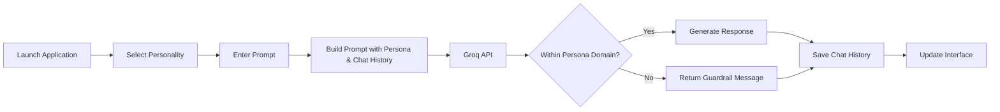

# Multi-Personality AI Chatbot

A multi-mode conversational AI application built with **Streamlit** and the **Groq API**. The chatbot supports multiple AI personalities, each with its own domain-specific knowledge, isolated conversation history, and strict guardrails to ensure focused, context-aware interactions.

---

## Overview

The application allows users to switch between different AI personalities (such as Mathematics, Medicine, and Technology) without losing conversation history. Each personality maintains an independent chat context and only responds within its designated knowledge domain.

The application also includes theme switching, model selection, JSON chat export, and optimized real-time inference powered by Groq.

---

# Features

- **Multiple AI Personalities**
  - Switch seamlessly between domain-specific assistants.

- **Domain Guardrails**
  - Each personality only answers questions related to its configured domain.
  - Off-topic questions receive a polite fallback response.

- **Independent Chat Memory**
  - Every personality stores its own conversation history.
  - Switching personas never overwrites previous chats.

- **Concise Responses**
  - Responses are automatically limited to approximately 3–4 sentences unless detailed explanations are requested.

- **Theme Support**
  - Light and Dark mode with custom CSS styling.

- **Model Selection**
  - Choose between supported Groq models such as:
    - Llama
    - Mixtral
    - Gemma

- **Conversation Export**
  - Download the active conversation as a JSON file.

- **Fast Inference**
  - Powered by Groq's ultra-low latency API.

| Personality | Domain | Behavior |
|-------------|--------|----------|
| 📐 Math Teacher | Algebra, Geometry, Calculus, Statistics, Mathematical Reasoning | Solves mathematical problems, explains concepts step-by-step, and politely declines non-mathematical questions. |
| 🩺 Doctor | General Health, Anatomy, Symptoms, First Aid, Wellness | Provides general medical information and encourages consulting healthcare professionals for diagnosis or treatment. |
| ✈️ Travel Guide | Destinations, Itineraries, Local Culture, Budget Travel | Recommends travel destinations, itineraries, and travel tips while declining unrelated requests. |
| 🍳 Chef | Recipes, Cooking Techniques, Baking, Meal Planning | Assists with recipes, ingredient substitutions, and cooking advice while refusing non-food-related queries. |
| 💻 Tech Support | Programming, Software, Networking, Operating Systems | Helps with coding, debugging, software installation, and technical troubleshooting only. |
| 💪 Fitness Coach | Exercise, Nutrition, Workout Plans, Healthy Lifestyle | Provides fitness guidance, workout routines, and wellness advice while avoiding unrelated topics. |
| 💰 Financial Advisor | Budgeting, Saving, Investing, Personal Finance | Offers educational financial guidance and money management tips without providing professional financial advice. |

# System Architecture

## Application Execution Flow

## Workflow



# Codebase Layout

```text
AI-PERSONALITY-CHATBOT/
│
├── .streamlit/
│   └── config.toml          # Streamlit configuration
│
├── .env                     # API keys (ignored by Git)
├── .gitignore               # Git ignore rules
│
├── app.py                   # Main Streamlit application
├── personalities.py         # Persona definitions and system prompts
│
├── requirements.txt         # Python dependencies
└── README.md                # Project documentation
```

---

# Technical Stack

| Component | Technology |
|-----------|------------|
| Frontend | Streamlit |
| LLM API | Groq |
| Language | Python 3.14.2 |
| Environment | python-dotenv |
| Styling | Custom CSS |
| Models | Llama, Mixtral, Gemma |

---

# Installation

## 1. Clone the Repository

```bash
git clone https://github.com/your-username/AI-PERSONALITY-CHATBOT.git

cd AI-PERSONALITY-CHATBOT
```

---

## Installation

Install the required dependencies:

```bash
pip install -r requirements.txt
```

Create a `.env` file in the project root:

```env
GROQ_API_KEY=your_groq_api_key_here
```

Run the application:

```bash
streamlit run app.py
```

Open your browser and visit:

```
http://localhost:8501
```

> **For Streamlit Community Cloud:** Add your API key in **Settings → Secrets**:
>
> ```toml
> GROQ_API_KEY="your_groq_api_key_here"
> ```
> 
# Project Highlights

- Multiple domain-specific AI assistants
- Strict prompt guardrails
- Independent chat history for every persona
- Dynamic Light/Dark themes
- Groq-powered low-latency inference
- Downloadable conversation history
- Clean Streamlit interface
- Modular personality configuration

# Author

## **Aiman Aslam**
