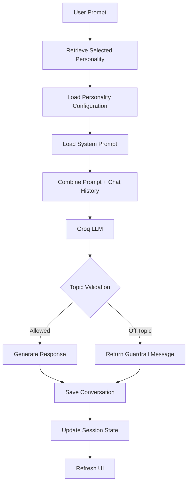

# Multi-Personality AI Chatbot

A multi-mode conversational AI application built with **Streamlit** and the **Groq API**. The chatbot supports multiple AI personalities, each with its own domain-specific knowledge, isolated conversation history, and strict guardrails to ensure focused, context-aware interactions.

---

## Overview

The application allows users to switch between different AI personalities (such as Mathematics, Medicine, and Technology) without losing conversation history. Each personality maintains an independent chat context and only responds within its designated knowledge domain.

The application also includes theme switching, model selection, JSON chat export, and optimized real-time inference powered by Groq.

---

# Features

- **Multiple AI Personalities**
  - Switch seamlessly between domain-specific assistants.

- **Domain Guardrails**
  - Each personality only answers questions related to its configured domain.
  - Off-topic questions receive a polite fallback response.

- **Independent Chat Memory**
  - Every personality stores its own conversation history.
  - Switching personas never overwrites previous chats.

- **Concise Responses**
  - Responses are automatically limited to approximately 3–4 sentences unless detailed explanations are requested.

- **Theme Support**
  - Light and Dark mode with custom CSS styling.

- **Model Selection**
  - Choose between supported Groq models such as:
    - Llama
    - Mixtral
    - Gemma

- **Conversation Export**
  - Download the active conversation as a JSON file.

- **Fast Inference**
  - Powered by Groq's ultra-low latency API.

---

# System Architecture

## Application Execution Flow

```mermaid
flowchart TD

A[User Opens Application]
-->
B[Initialize Streamlit Session State]

B --> C{Existing State?}

C -- No --> D[Initialize Messages, Theme, Model & Personality]
C -- Yes --> E[Load Existing Session]

D --> F[Load CSS Theme]
E --> F

F --> G[Render Sidebar]

G --> H{Sidebar Actions}

H --> I[Switch Personality]

H --> J[Toggle Theme]

H --> K[Select Groq Model]

H --> L[Clear Current Chat]

F --> M[Render Main Interface]

M --> N[Display Conversation]

M --> O[Display Chat Input]

O --> P{Prompt Submitted?}

P --> Q[Append User Message]

Q --> R[Create API Payload]

R --> S[Groq Chat Completion API]

S --> T[Receive Response]

T --> U[Store Assistant Response]

U --> V[st.rerun()]

V --> M
```

---

## Prompt Processing & Guardrail Pipeline



---

# Codebase Layout

```text
AI-PERSONALITY-CHATBOT/
│
├── .streamlit/
│   └── config.toml          # Streamlit configuration
│
├── .env                     # API keys (ignored by Git)
├── .gitignore               # Git ignore rules
│
├── app.py                   # Main Streamlit application
├── personalities.py         # Persona definitions and system prompts
│
├── requirements.txt         # Python dependencies
└── README.md                # Project documentation
```

---

# Technical Stack

| Component | Technology |
|-----------|------------|
| Frontend | Streamlit |
| LLM API | Groq |
| Language | Python 3.10+ |
| Environment | python-dotenv |
| Styling | Custom CSS |
| Models | Llama, Mixtral, Gemma |

---

# Installation

## 1. Clone the Repository

```bash
git clone https://github.com/your-username/AI-PERSONALITY-CHATBOT.git

cd AI-PERSONALITY-CHATBOT
```

---

## 2. Create a Virtual Environment

### Linux / macOS

```bash
python3 -m venv venv

source venv/bin/activate
```

### Windows

```bash
python -m venv venv

venv\Scripts\activate
```

---

## 3. Install Dependencies

```bash
pip install -r requirements.txt
```

---

## 4. Configure Environment Variables

Create a `.env` file in the project root.

```env
GROQ_API_KEY=your_groq_api_key_here
```

If deploying to **Streamlit Cloud**, add the secret as:

```toml
GROQ_API_KEY="your_groq_api_key_here"
```

---

# Running the Application

Start the Streamlit server:

```bash
streamlit run app.py
```

Open your browser and navigate to:

```
http://localhost:8501
```

---

# Configuration

## Adding a New Personality

All personalities are stored in `personalities.py`.

Each personality follows this structure:

```python
"Persona Name": {
    "icon": "Icon",
    "color": "#HEXCOLOR",
    "gradient": "linear-gradient(...)",
    "allowed_topics": [
        "Topic 1",
        "Topic 2"
    ],
    "system_prompt": (
        "Role definition."
        "Reject off-topic requests."
        "Keep responses concise."
    ),
    "suggested_prompts": [
        "Prompt 1",
        "Prompt 2"
    ],
}
```

Simply add another dictionary entry to create a new AI personality.

---

# Project Highlights

- Multiple domain-specific AI assistants
- Strict prompt guardrails
- Independent chat history for every persona
- Dynamic Light/Dark themes
- Groq-powered low-latency inference
- Downloadable conversation history
- Clean Streamlit interface
- Modular personality configuration

---

# Future Improvements

- Voice input and speech synthesis
- Image understanding
- Persistent database storage
- Authentication and user accounts
- Conversation search
- Additional AI personalities
- Multi-language support

---

# Author

## **Aiman Aslam**
